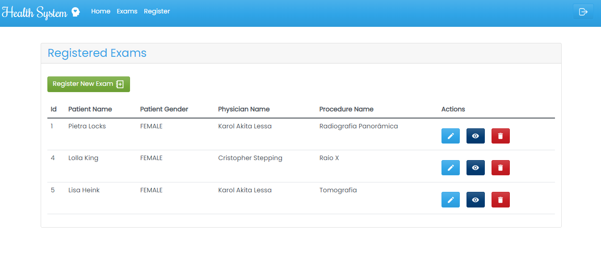
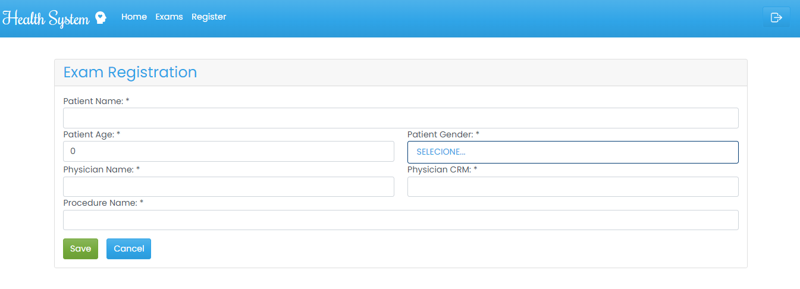

<h1 align="center">REACT - BOOTSTRAP - JS</h1>

FRONTEND: desenvolvimento de app para a aplicação de finanças do curso de Spring Boot + React JS da Udemy.

Page Login

Page Sign Up

Page Home

Page List Exams

Page Save New Exam

Page View Details Exam

Page Edit Exam

## Available Scripts

In the project directory, you can run:

### `npm install`

Run this command to install the node_modules folder and its dependencies.

### `npm start`

Runs the app in the development mode.\
Open [http://localhost:3000](http://localhost:3000) to view it in your browser.

The page will reload when you make changes.\
You may also see any lint errors in the console.

